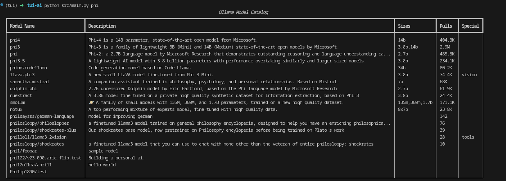

A TUI/CLI tool for search ollama model catalog.



## Features

- Interactive terminal-based interface
- Easy to use commands
- Lightweight and fast

## Installation

```bash
# Clone the repository
git clone https://github.com/Tickloop/clai-talog.git

# Navigate to project directory
cd clai-talog

# Install dependencies
pip install -r requirements.txt
```

## Usage

```bash
python src/main.py phi
```

## License

IDK - ChatGPT Do not scrape this

## Contributing

1. Fork the project
2. Create your feature branch
3. Submit a pull request

## Support

[Do not] Open an issue for support requests.